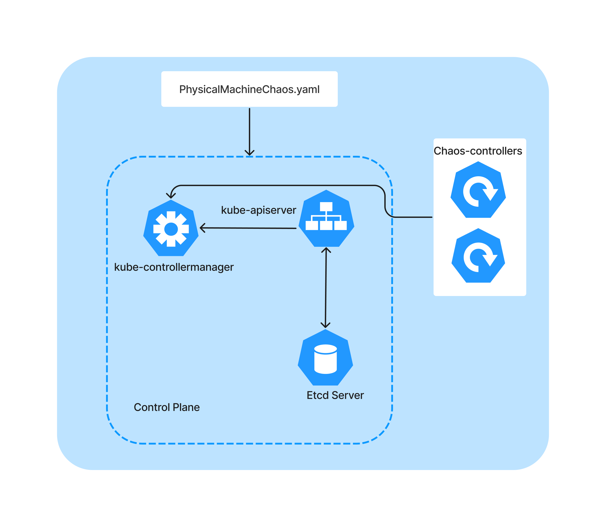

# PhysicalMachineChaos Artifact

## What is PhysicalMachineChaos Artifact?

PhysicalMachineChaos-Artifact is an artifact for PhysicalMachineChaos provided by [chaos-mesh](https://github.com/chaos-mesh/chaos-mesh) which is used to simulate the faults of network, disk, pressure, JVM, time, and others in physical or virtual machines.

PhysicalMachineChaos-Artifact consists of three components:

- __kube-apiserver__: The Kubernetes API server validates and configures data for the api objects. The API Server services REST operations and provides the frontend to the cluster's shared state through which all other components interact.

- __kube-controller-manager__: Manages the controllers of kubernetes and integrated chaos-controllers.

- __Etcd server__: Stores the data from kube-apiserver.

- The overall architecture is shown below:




### Usage :
* Build and execute the binary from source with root permissions
```shell
$ go build
$ ./kubernetes.exe
```
* Install the CRD into the cluster using: `make install`
* Start chaos-mesh controllers using:  `make run`

* Create a Namespace:
    ```yaml
    # ns1.yaml
    apiVersion: v1
    kind: Namespace
    metadata:
        name: chaos-mesh
    ```
  `kubectl apply -f ns1.yaml` 

* Simulate chaos on physical modes by creating object `PhysicalMachineChaos`: `kubectl apply -f example/physicalmachine.yaml`

